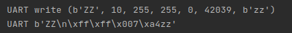
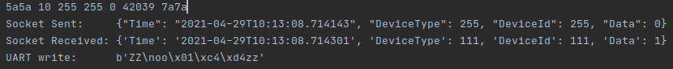
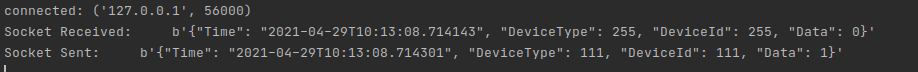

## Модуль COM-порта для платформы ТПГ
### Общие требования к разработке:
>  Протокол обмена с внешними устройствами, полное описания протокола.

Протокол передачи данных с внешними устройствами  com/uart.
Формат сообщения
```python
request = struct.pack('2sBBBBH2s', preamble, size, device_type, device_id, mess, crc, postamble)
#Преамбула 5A5A = 2 байта
preamble: b'ZZ',
Размер пакета = 1 байт (1-255)
size: 10, 
Тип устройства = 1 байт (1-255)
device_type: 255,
ID устройства = 1 байт (1-255)
device_id: 255,
Сообщение/команда = 1 байт (1-255)
mess: 0,
CRC-16 = 2 байта
crc: 42039, 
Постамбула 7A7A = 2 байт
postamble: b'zz'
Пример сообщения, отправленного по com:
b'ZZ\n\xff\xff\x007\xa4zz'
```

    2. Протокол обмена по web-socket, полное описание протокола.

Протокол обмена по web-socket это web-socket - протокол связи поверх TCP-соединения.

Для тестирования сокет соединения был использован базовый модуль socket.
Отправка команд платформы осуществляется запакованным в байты json вида:
```json
    {"Time": "2021-04-29T10:13:08.714143", "DeviceType": 255, "DeviceId": 255, "Data": 0}
```
Json имеет следующие поля:
	Time,
	DeviceType,
	DeviceId,
	Data

    3. формат хранения параметров в json, полное описание протокола.

Json как формат пересылки по сокету
```json
  Формат даты/времени : ("%d-%m-%Y %H:%M")
  DeviceType : ( 0 — 255 )
  DeviceId : ( 0 — 255 )
  Data : ( 1 byte )
  sent_data = {
    "Time": "2021-04-29T10:13:08.714143",
    "DeviceType": 111,
    "DeviceId": 111,
    "Data": 1
}
```

> Json как конфигурационный файл config.json

Каждый модуль системы имеет конфигурационный файл одинакого типа
```json
{
  "UART": {
    "port_read": "/dev/ttyUSB0",
    "port_write": "/dev/ttyUSB1",
    "baudrate": 115200,
    "timeout": 0.01
  },
  "SOCKET": {
    "port": 9090,
    "ip": "localhost"
  }
}
```
    Имеет ключ UART:
        По нему можно получить необходимые для передачи по com порту параметры:
        port_read - порт com порта для чтения
        port_write - порт com порта для записи

     и SOCKET:
        ip — ip адрес по которому можно получить/отправить команду
        port — port  по которому можно получить/отправить команду
>
    4. Используемые инструменты разработки.

Используемые библиотеки requirements.txt

    5. Среда тестирования модуля.
В качестве тестирования для первоначальной версии модуля был создан модуль uartinput
Он отсылает пакет по com-порту, тем самым симулируя получение команды от устройства.
Далее модуль uartoutput считывает, проверяет целостность и отправляет по сокету упакованный json, добавляя временную метку. 
Далее модуль Server принимает пакет и отправляет обратно другой пакет, такого же типа, но с другими данными и другой временной меткой для отслеживания и проверки двухсторонней связи.
Далее отправленный по сокету пакет принимается тем же модулем uartoutput, который отправлял на сервер пакет. Он распаковывает полученное сообщение и начинает упаковывать его в пакет для отправки в com: 
```python
    Добавляется преамбула: b'\x5A\x5A'
    Добавляется размер пакета : size
    Добавляется контрольная сумма расчитанная по CRC16:
    crc = (crc16.crc16xmodem(body))
    Добавляется постамбула: b'\x7a\x7a'
```

Далее данный пакет отправляется на com порт и затем начинается цикл отправки-пересылки сообщений UART-SOCKET-UART-SOCKET...etc
Данный реализованный цикл демонстрирует работу системы без пропусков пакетов.

Результат работы модуля uartinput:



Результат работы модуля uartoutput:



Результат работы модуля сервера:


